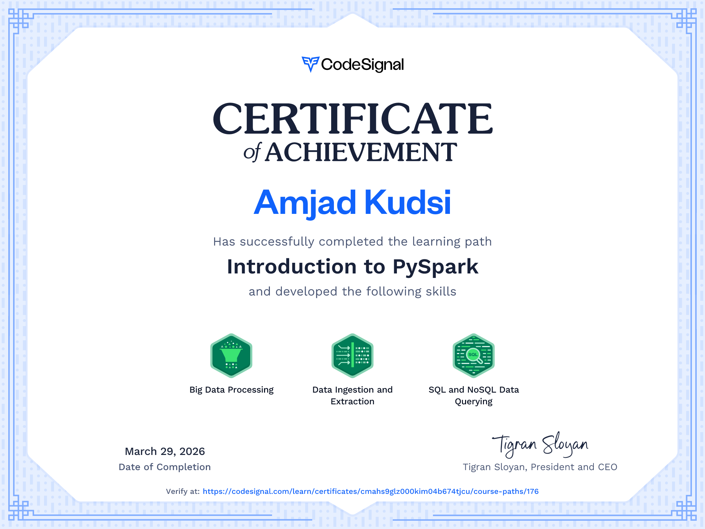

# Intro-to-PySpark
Big Data with PySpark, combining the power of Python and Spark's distributed computing along with RDDs, DataFrames, SQL operations, and MLlib essentials. Demonstrating practical skills in data manipulation and machine learning, paving my path as a powerful data engineer.

